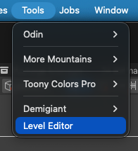
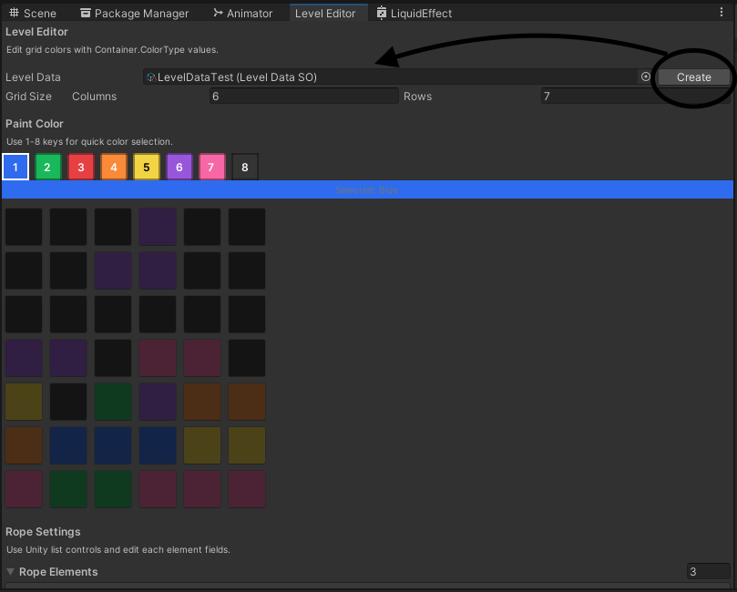
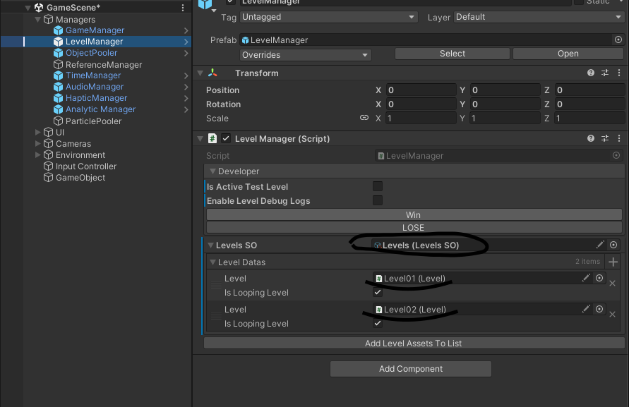

# Zinky-CaseStudy Mert Cimen

## Level Editor

--To open the Level Editor window in Unity, click the Level Editor option under the Tools tab.

In the opened window, you can create a new LevelData by clicking the Create New LevelData button, or select an existing one to edit it directly.

## LevelManager 
The Scriptable Object inside the LevelManager holds a LevelPrefab for each level, and each LevelPrefab must contain its own LevelDataSO that is configured for the corresponding level.

